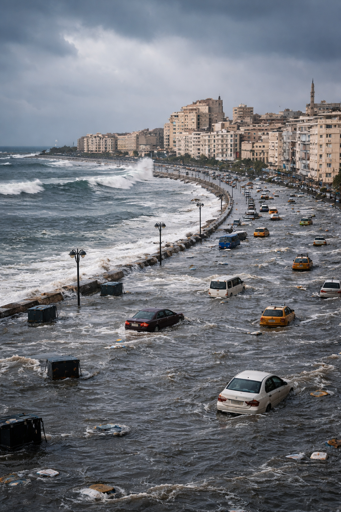
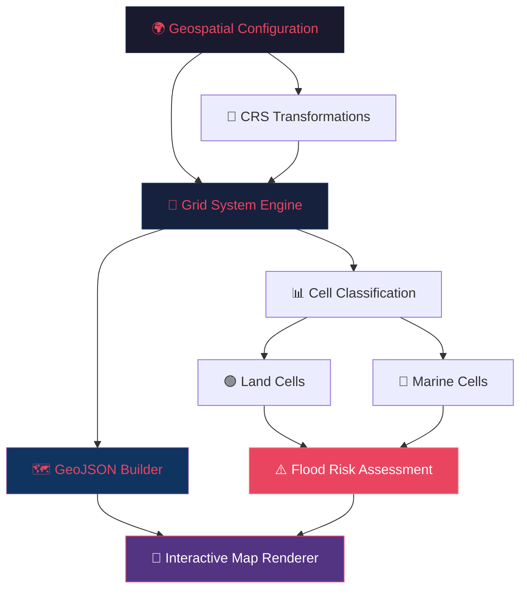
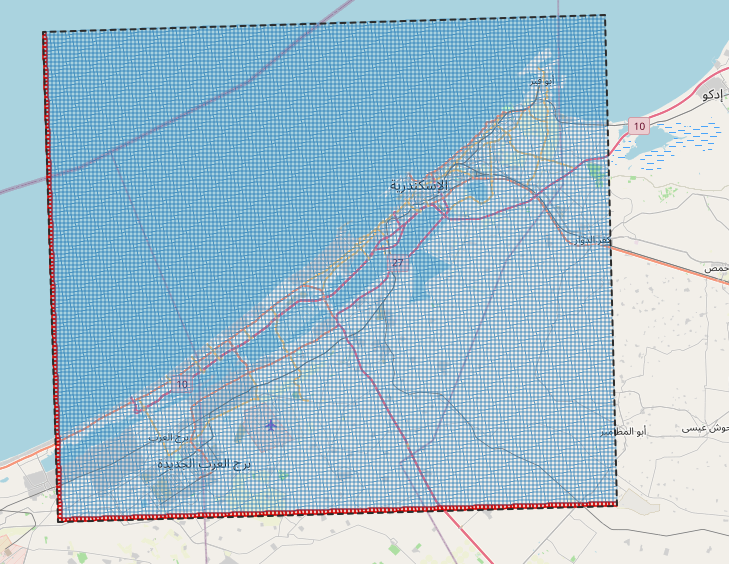
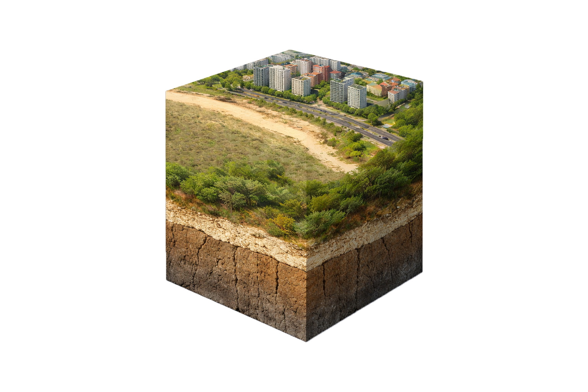
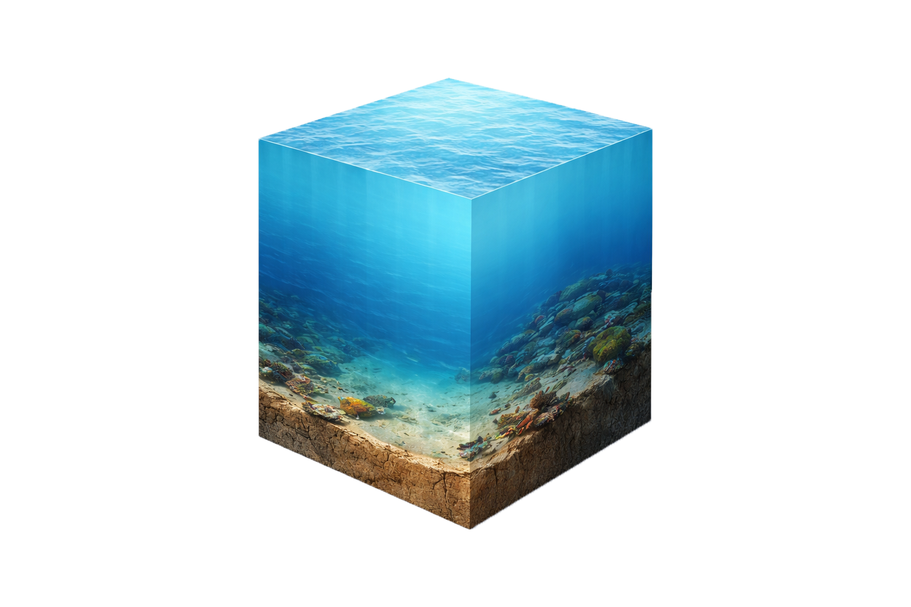
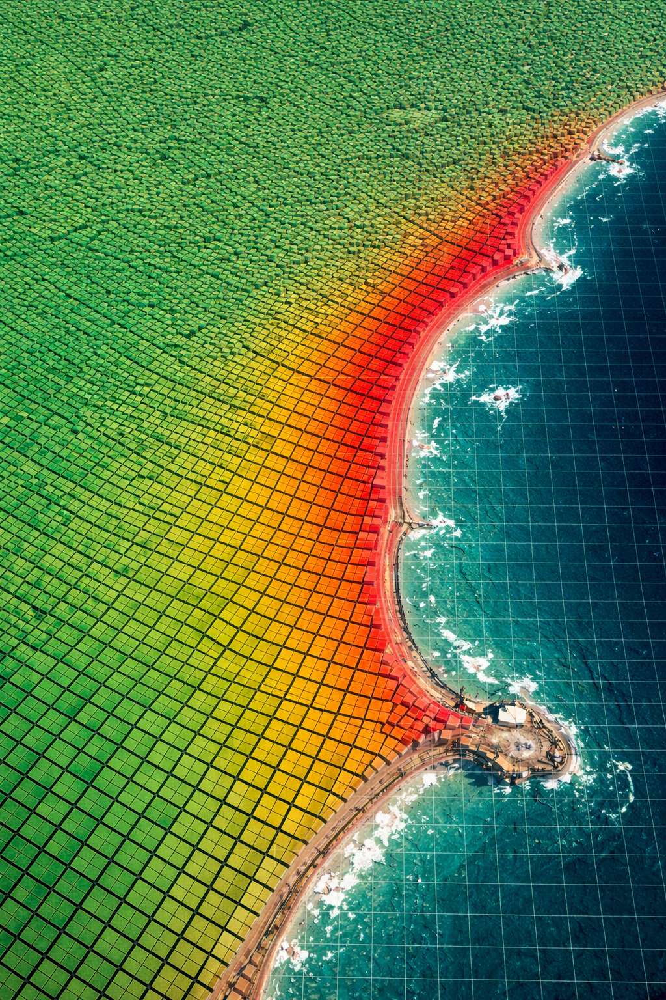

<div align="center">

<!-- Hero Banner -->


<br/>

# 🌊 Alexandria Flood Risk Prediction

### *Advanced Geospatial Analysis & Environmental Modeling*

[](https://python.org)
[](https://jupyter.org)
[](https://numpy.org)
[](https://pandas.pydata.org)
[](https://python-visualization.github.io/folium/)
[](LICENSE)

<br/>

**A comprehensive geospatial pipeline for predicting and visualizing flood risk across the Alexandria Governorate, Egypt — leveraging grid-based spatial modeling, coordinate transformations, and interactive mapping.**

<br/>

[📓 View Notebook](#-notebook) · [🚀 Quick Start](#-quick-start) · [📊 Methodology](#-methodology) · [🗺️ Results](#%EF%B8%8F-interactive-grid-visualization)

---

</div>

<br/>

## 📋 Table of Contents

- [🔍 Overview](#-overview)
- [🌍 Why Alexandria?](#-why-alexandria)
- [🧬 Project Architecture](#-project-architecture)
- [📊 Methodology](#-methodology)
- [🗺️ Interactive Grid Visualization](#%EF%B8%8F-interactive-grid-visualization)
- [⚙️ Tech Stack](#%EF%B8%8F-tech-stack)
- [🚀 Quick Start](#-quick-start)
- [📁 Project Structure](#-project-structure)
- [📓 Notebook](#-notebook)
- [🤝 Contributing](#-contributing)
- [📄 License](#-license)

<br/>

## 🔍 Overview


Alexandria, Egypt's second-largest city and a major Mediterranean port, faces **escalating flood risks** driven by climate change, sea-level rise, and aging urban drainage infrastructure. This project builds a **data-driven geospatial pipeline** to model, quantify, and visualize flood vulnerability at a granular cell-by-cell level across the entire governorate.

The system divides the Alexandria region into a high-resolution **500m × 500m metric grid** (~18,800+ cells), classifies each cell by terrain type (land vs. marine), and computes flood risk indicators using elevation data, proximity to coastline, and environmental factors.

### 🎯 Key Objectives

- **Grid-Based Spatial Modeling** — Decompose the study area into thousands of georeferenced cells for precise analysis
- **Coordinate System Engineering** — Seamlessly transform between WGS84 (geographic) and UTM Zone 36N (metric) projections
- **Interactive Visualization** — Generate explorable maps with hover tooltips, axis highlighting, and layer controls
- **Risk Classification** — Categorize cells into flood risk tiers based on multi-factor environmental modeling

<br clear="right"/>

---

<br/>

## 🌍 Why Alexandria?

Alexandria is one of the **most climate-vulnerable coastal cities** in the world. With over **5 million residents** and critical infrastructure sitting at or near sea level, even moderate flooding events can cause catastrophic damage.

> *"Alexandria ranks among the top 10 most threatened coastal cities globally due to sea-level rise."*  
> — **IPCC Climate Assessment Reports**

| Threat Factor | Impact |
|:---|:---|
| 🌊 Sea-Level Rise | Projected 0.5–1.0m rise by 2100, threatening low-lying districts |
| 🌧️ Extreme Rainfall | Increasing frequency of intense storm events overwhelming drainage |
| 🏗️ Urban Density | Rapid urbanization reduces natural absorption capacity |
| 📉 Land Subsidence | Nile Delta subsidence compounds relative sea-level rise |

<br/>

---

<br/>

## 🧬 Project Architecture



The pipeline follows a **modular, object-oriented design**:

1. **`SpatialConfig`** — Immutable dataclass holding all geographic boundaries, CRS definitions, and grid resolution parameters
2. **`GeoTransformer`** — Engine class managing bidirectional coordinate transformations and grid index calculations
3. **`build_grid_geojson()`** — Generates optimized GeoJSON FeatureCollections with cell metadata for interactive rendering
4. **`render_interactive_grid()`** — Produces Folium-based maps with styled layers, tooltips, and bounding box overlays

<br/>

---

<br/>

## 📊 Methodology

### 1️⃣ Spatial Configuration & CRS Setup

The study area is bounded by precise geographic coordinates covering the entire Alexandria Governorate:

```python
@dataclass(frozen=True)
class SpatialConfig:
    LAT_MIN: float = 30.80    # Southern boundary
    LAT_MAX: float = 31.40    # Northern boundary
    LON_MIN: float = 29.40    # Western boundary
    LON_MAX: float = 30.15    # Eastern boundary
    GRID_STEP_METERS: int = 500  # Cell resolution
    CRS_GEO: str = "EPSG:4326"   # WGS84 Geographic
    CRS_PROJ: str = "EPSG:32636" # UTM Zone 36N (Metric)
```

Two coordinate reference systems are used:
- **EPSG:4326 (WGS84)** — For geographic representation (latitude/longitude)
- **EPSG:32636 (UTM 36N)** — For metric calculations (meters), optimal for the Alexandria region

### 2️⃣ Grid System Construction

<div align="center">


*Fig: High-resolution 500m × 500m grid system overlaid on the Alexandria Governorate*
</div>

<br/>

The `GeoTransformer` engine converts the geographic bounding box into a **metric grid** using UTM projection, yielding:

| Parameter | Value |
|:---|:---|
| Grid Columns (X-axis) | **147** |
| Grid Rows (Y-axis) | **128** |
| Total Cells | **18,816** |
| Cell Resolution | **500m × 500m** |
| Coverage Area | ~4,704 km² |

### 3️⃣ Cell Classification

Each grid cell is classified based on its geographic characteristics:

<div align="center">
<table>
<tr>
<td align="center" width="50%">



**🟢 Land Cell**  
*Terrain with urban/rural features, vegetation, and soil layers — assessed for drainage capacity and flood absorption*

</td>
<td align="center" width="50%">



**🔵 Marine Cell**  
*Mediterranean Sea coverage with underwater terrain — analyzed for storm surge propagation and coastal flood vectors*

</td>
</tr>
</table>
</div>

### 4️⃣ Interactive Mapping & Visualization

The final output is a **fully interactive Folium map** with:
- 🎯 **Hover Tooltips** — Displaying cell indices, center coordinates, and metadata
- 🔴 **Axis Highlighting** — Red-highlighted cells along X=0 and Y=0 for spatial orientation
- 📦 **Bounding Box Overlay** — Dashed outline showing the study area extent
- 🎨 **Dynamic Styling** — Hover effects with color transitions for cell inspection

<br/>

---

<br/>

## 🗺️ Interactive Grid Visualization

<div align="center">


*Fig: Color-coded flood risk estimation grid — Green (Low Risk) → Yellow (Moderate) → Red (High Risk)*
</div>

<br/>

The heatmap visualization reveals **critical flood risk patterns**:
- 🔴 **High-risk zones** concentrate along the Mediterranean coastline and low-lying districts
- 🟡 **Moderate-risk areas** extend inland through urban corridors with insufficient drainage
- 🟢 **Low-risk regions** correspond to elevated terrain with better natural drainage capacity

<br/>

---

<br/>

## ⚙️ Tech Stack

<div align="center">

| Category | Technologies |
|:---|:---|
| **Language** |  |
| **Data Science** |    |
| **Geospatial** |   |
| **Visualization** |   |
| **Environment** |  |

</div>

<br/>

---

<br/>

## 🚀 Quick Start

### Prerequisites

- Python 3.10 or higher
- Jupyter Notebook / JupyterLab

### Installation

```bash
# 1. Clone the repository
git clone https://github.com/yourusername/Alex_Flood_Risk_Prediction.git
cd Alex_Flood_Risk_Prediction/project

# 2. Create and activate a virtual environment (recommended)
python -m venv venv
source venv/bin/activate        # macOS/Linux
venv\Scripts\activate           # Windows

# 3. Install dependencies
pip install numpy pandas xarray pyproj folium matplotlib seaborn jupyter

# 4. Launch the notebook
jupyter notebook alex-flood-risk-prediction.ipynb
```

### Dependencies

```
numpy>=1.24.0
pandas>=2.0.0
xarray>=2023.1.0
pyproj>=3.5.0
folium>=0.14.0
matplotlib>=3.7.0
seaborn>=0.12.0
```

<br/>

---

<br/>

## 📁 Project Structure

```
Alex_Flood_Risk_Prediction/
│
├── 📓 alex-flood-risk-prediction.ipynb  # Main analysis notebook
├── 📖 README.md                          # Project documentation
│
├── 📂 Documentation/
│   ├── Alex_Flood_Risk_Prediction_Documentation.pdf  # Full technical docs
│   ├── Alex_Flood_Risk_Prediction_Proposal.pdf       # Research proposal
│   └── ITC_Proposal.pdf                              # ITC collaboration proposal
│
└── 📂 pictures/
    ├── alex.png              # Aerial view of Alexandria
    ├── flood-estimation.png  # Real flooding scenario
    ├── grid-estimation.png   # Risk heatmap visualization
    ├── grid_cells.PNG        # Grid overlay on map
    ├── land-cell.png         # Land cell 3D representation
    └── marine-cell.png       # Marine cell 3D representation
```

<br/>

---

<br/>

## 📓 Notebook

The Jupyter notebook is structured as a **clean, production-grade pipeline**:

| Section | Description |
|:---|:---|
| **1. Environment Setup** | Library imports, global visualization themes (Seaborn darkgrid), warning configuration |
| **2. Geospatial Configuration** | `SpatialConfig` dataclass and `GeoTransformer` engine with CRS transformations |
| **3. Grid System Initialization** | GeoJSON construction, interactive Folium map rendering with tooltips and axis highlighting |

Each section follows **senior data science standards** with comprehensive docstrings, type hints, and OOP design patterns.

<br/>

---

<br/>

## 🤝 Contributing

Contributions are welcome! Here's how you can help:

1. 🍴 **Fork** the repository
2. 🌿 **Create** a feature branch (`git checkout -b feature/amazing-feature`)
3. 💾 **Commit** your changes (`git commit -m 'Add amazing feature'`)
4. 📤 **Push** to the branch (`git push origin feature/amazing-feature`)
5. 🔀 **Open** a Pull Request

### Ideas for Contribution

- [ ] Integrate real elevation data (DEM) for enhanced risk scoring
- [ ] Add historical flood event overlay layers
- [ ] Implement machine learning models for predictive risk classification
- [ ] Connect to live weather APIs for real-time storm surge warnings
- [ ] Build a Streamlit/Dash web dashboard for non-technical stakeholders

<br/>

---

<br/>

## 📄 License

This project is licensed under the **MIT License** — see the [LICENSE](LICENSE) file for details.

<br/>

---

<div align="center">

<br/>

**Built with passion for  Alexandria's resilience against climate change** ❤️

**Author:** Mustafa Younis · May 2026

<br/>


<br/><br/>

*If you found this project useful, please consider giving it a ⭐*

<br/>

</div>
